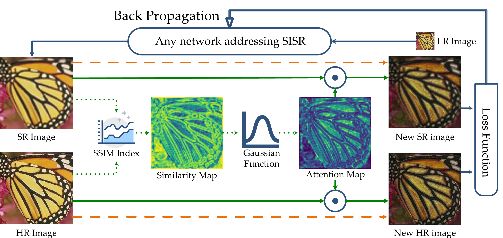
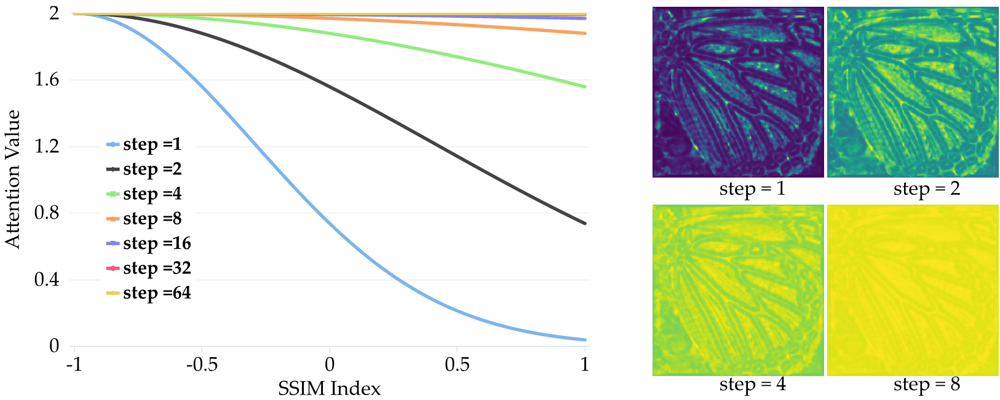
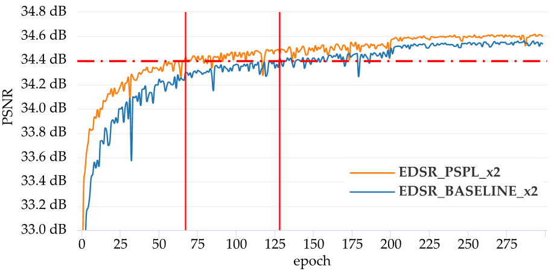

# Pixel-level self-paced learning for super-resolution

This is  an official implementaion of PSPL, which has been accepted by ICASSP 2020.

[Pixel-level self-paced learning for super-resolution](http://crabwq.github.io/pdf/2020%20Pixel-Level%20Self-Paced%20Learning%20for%20Super-Resolution.pdf)
## Requirements

This code is forked from [thstkdgus35/EDSR-PyTorch](https://github.com/thstkdgus35/EDSR-PyTorch), As its README described, following libraries are required:

- Python 3.6+ (Python 3,7,0 in ny experiments)
- PyTorch >= 1.0.0 (1.1.0 in my experiments)
- numpy
- skimage
- imageio
- matplotlib
- tqdm

## Core Parts



detail code is shown in [Loss.forward](https://github.com/Elin24/PSPL), which can be simplified as:

```python
# take L1 Loss as example

import torch
import torch.nn as nn
import torch.nn.functional as F
from . import pytorch_ssim

class Loss(nn.modules.loss._Loss):
    def __init__(self, spl_alpha, spl_beta, spl_maxVal):
        super(Loss, self).__init__()
        self.loss = nn.L1Loss()
        self.alpha = spl_alpha
        self.beta = spl_beta
        self.maxVal = spl_maxVal

    def forward(self, sr, hr, step):
        # calc sigma value
        sigma = self.alpha * step + self.beta
        # define gauss function
        gauss = lambda x: torch.exp(-((x+1) / sigma) ** 2) * self.maxVal
        # ssim value
        ssim = pytorch_ssim.ssim(hr, sr, reduction='none').detach()
        # calc attention weight
        weight = gauss(ssim).detach()
        nsr, nhr = sr * weight, hr * weight
        # calc loss
        lossval = self.loss(nsr, nhr)
        return loss_sum
```

the library pytorch_ssim is focked from [Po-Hsun-Su/pytorch-ssim](https://github.com/Po-Hsun-Su/pytorch-ssim) and rewrite some details for adopting it to our requirements.

Attention weight values change according to *SSIM Index* and *step*:


## Experiment Results



## Citation

If you find this project useful for your research, please cite:

```bibtex
@inproceedings{lin2020pixel,
  title={Pixel-level self-paced learning for super-resolution},
  author={Lin, Wei and Gao, Junyu and Wang, Qi and Li, Xuelong},
  booktitle={2020 IEEE International Conference on Acoustics, Speech and Signal Processing (ICASSP)},
  year={2020},
  organization={IEEE}
}
```
